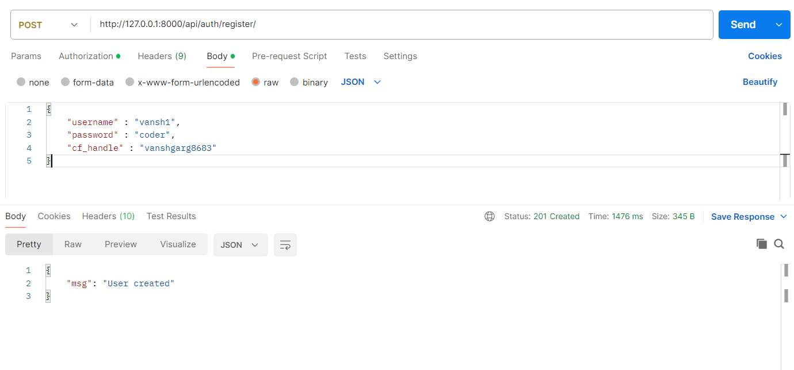
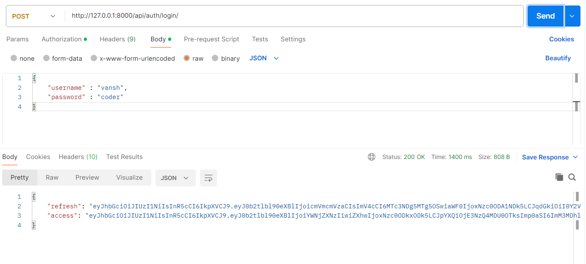
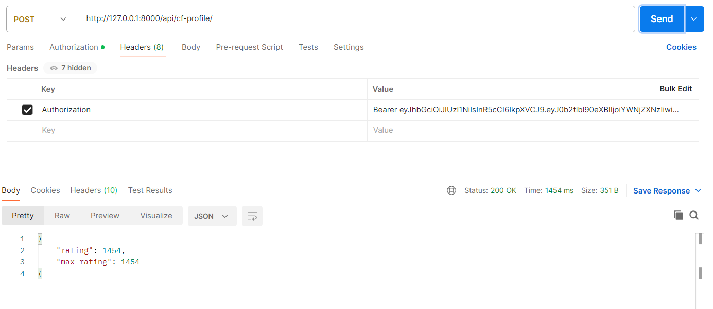
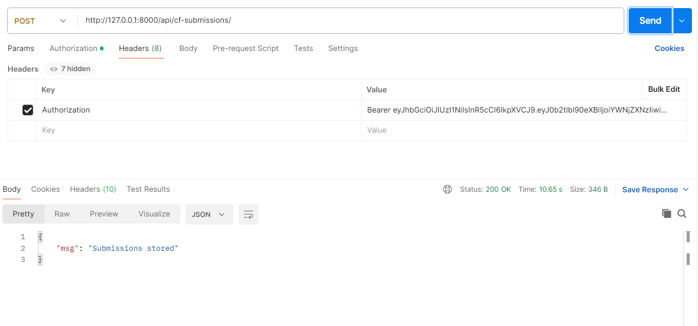
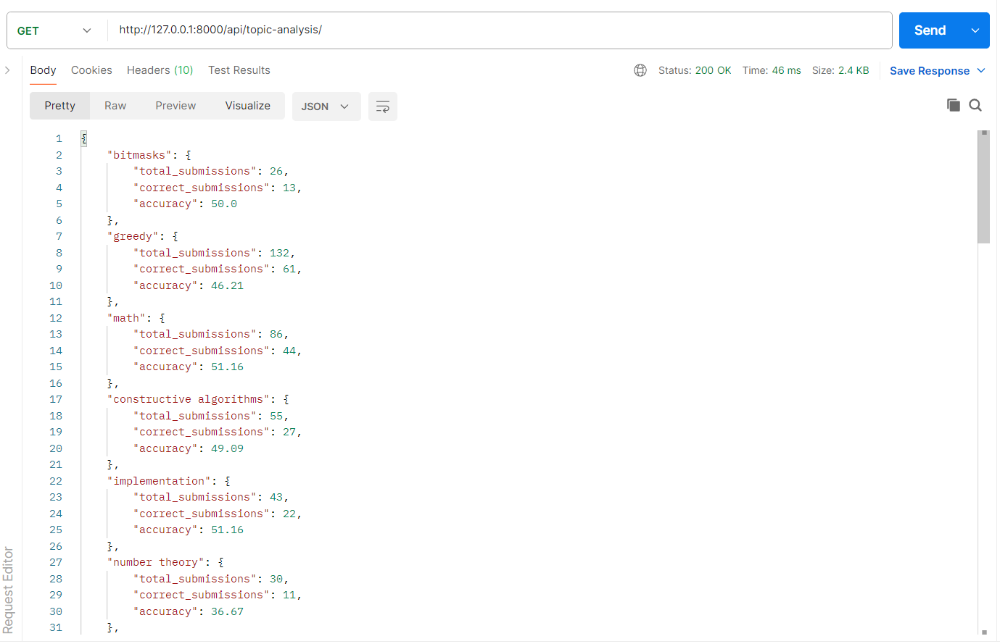
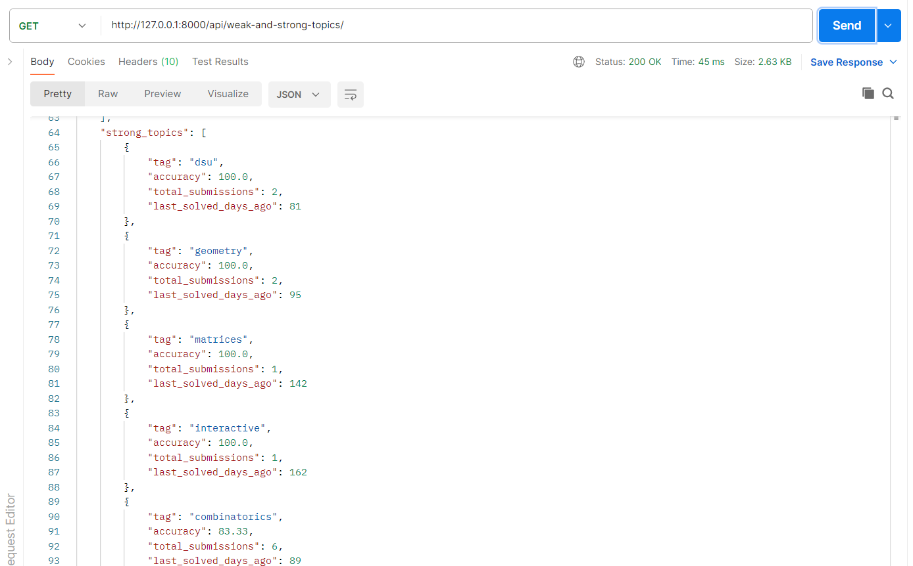
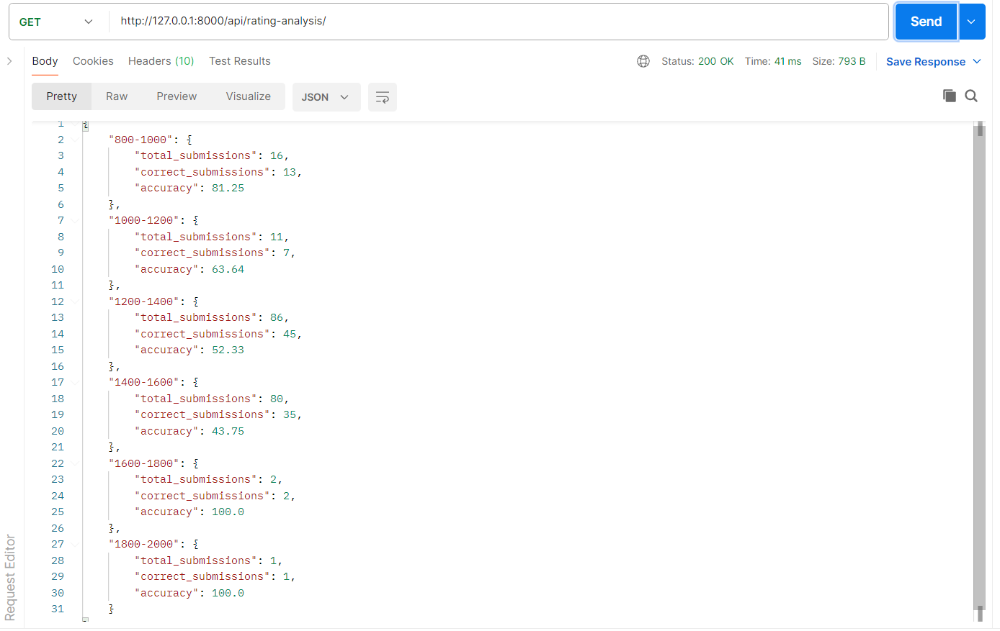
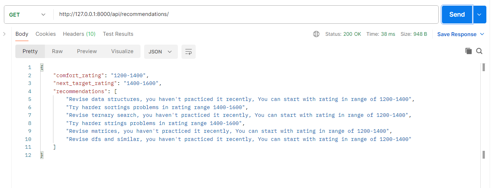

# 🚀 Smart Competitive Programming Tracker (Backend)

A powerful backend system that analyzes a user's competitive programming performance using Codeforces data and provides **deep insights, analytics, and personalized recommendations**.

---

## 📌 Features

### 🔐 Authentication

* User registration & login using JWT
* Secure password hashing
* Custom user model with Codeforces handle support


<br>


---

### 📊 Codeforces Integration

* Fetch user profile (rating, max rating)
* Fetch and store latest submissions (up to 200)


<br>


---

### 📈 Analytics

#### 1. Topic Analysis

* Tracks performance per topic (dp, graphs, etc.)
* Calculates:

  * Total submissions
  * Correct submissions
  * Accuracy %



---

#### 2. Weak & Strong Topic Detection

* Identifies weak topics based on:

  * Low accuracy
  * High attempts but poor performance


<br>


---

#### 3. Rating Analysis

* Groups problems into rating buckets:

  * Example: 800–1000, 1000–1200
* Calculates accuracy per bucket



---

#### 4. Smart Recommendations 🔥

* Suggests:

  * Topics to improve
  * Difficulty level to practice
  * Topics to revise (based on inactivity)
* Determines:

  * Comfort rating
  * Next target rating



---

## 🛠️ Tech Stack

* Django
* Django REST Framework
* JWT Authentication (SimpleJWT)
* SQLite
* Codeforces API

---

## 📂 Project Structure

```
CP_TRACKER/
│
├── accounts/        # Authentication system
├── analytics/       # Core analytics logic
├── CP_TRACKER/      # Project settings
└── db.sqlite3
```

---

## ⚙️ Setup Instructions

### 1. Clone the repository

```bash
git clone https://github.com/your-username/cp-tracker.git
cd cp-tracker
```

### 2. Create virtual environment

```bash
python -m venv venv
source venv/bin/activate   # Windows: venv\Scripts\activate
```

### 3. Install dependencies

```bash
pip install -r requirements.txt
```

### 4. Run migrations

```bash
python manage.py migrate
```

### 5. Start server

```bash
python manage.py runserver
```

---

## 🔑 API Endpoints

### Auth

* `POST /api/auth/register/`
* `POST /api/auth/login/`

### Codeforces

* `POST /api/cf-profile/`
* `POST /api/cf-submissions/`

### Analytics

* `GET /api/topic-analysis/`
* `GET /api/weak-and-strong-topics/`
* `GET /api/rating-analysis/`
* `GET /api/recommendations/`

---

## 📬 Sample Workflow

1. Register user
2. Login → get JWT token
3. Add Codeforces handle
4. Fetch submissions
5. View analytics & recommendations

---

## 🧪 Testing (Postman)

* All APIs are tested using Postman
* Include:

  * Request/response screenshots
  * JWT authentication flow
  * 
---

## 🚧 Future Improvements

* Frontend (React-based dashboard)
* Graph visualizations (charts for progress)
* LeetCode integration
* Real-time sync with Codeforces
* Advanced recommendation engine (ML-based)

---

## 💡 Key Highlights

* Real-world API integration
* Data analysis using structured logic
* Clean backend architecture
* Scalable design for future frontend

---

## 👨‍💻 Author

**Vansh Garg**

* Competitive Programmer (Codeforces, LeetCode)
* Backend Developer (Django)

---

## ⭐ Note

Frontend is currently under development and will be integrated in future updates.
